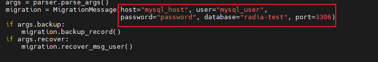
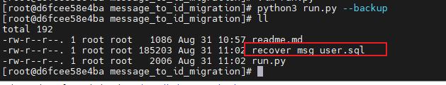
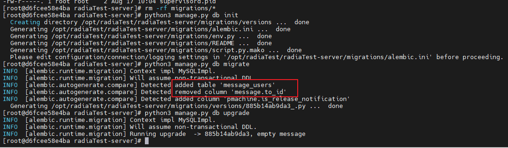
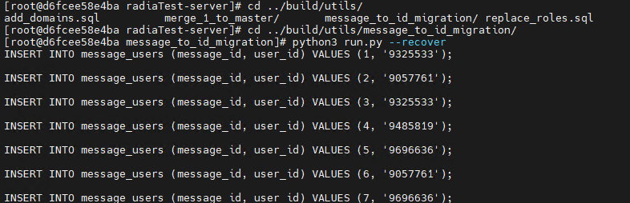

#                                  消息中心重构后数据库变更方法

背景:消息中心重构后删除to_id字段，当数据迁移时会丢失原有消息所有者, 必须采用手动迁移的方式, 保障数据平迁。

迁移前建议将数据库备份到本地，避免操作失误导致生产环境数据丢失无法恢复。

## step 1

进入build/utils/message_to_id_migration下

修改run.py内数据库相关的连接参数



执行以下命令

```shell
python3 run.py --backup
```

该脚本会将message的id,to_id查询出来转为数据插入脚本recover_msg_user.sql



## step 2

清空migrate目录,删除alembic_version下的版本记录再分别执行以下命令:

   ```shell
   python3 manage.py db init 
   python3 manage.py db migrate
   python3 manage.py db upgrade
   ```



执行完成后，message将丢失to_id，额外增加消息-用户中间表message_users

## step 3

执行以下命令来恢复原有消息所有者

```shell
python3 run.py --recover
```



执行完成后确认message条数是否与message_users新增的记录数一致，一致则说明数据已完整平移

