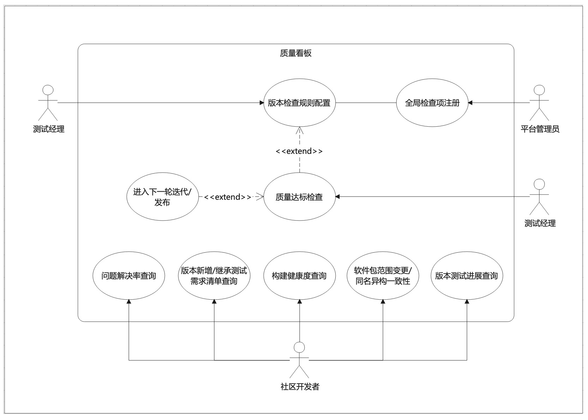
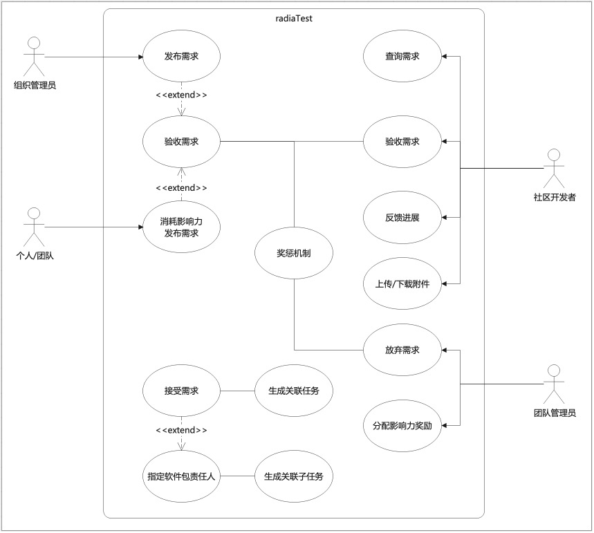
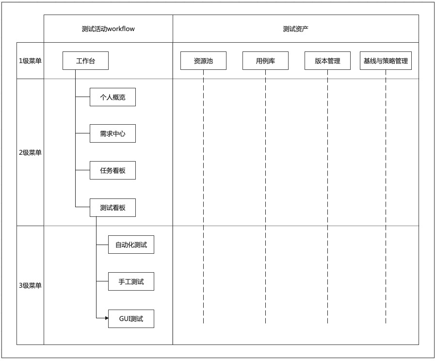
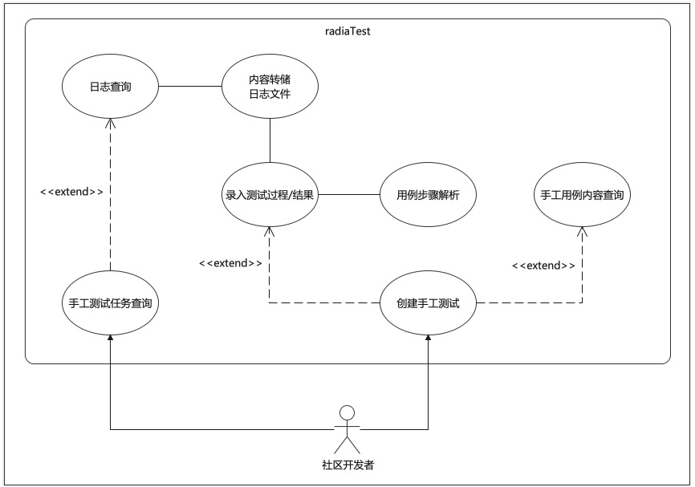
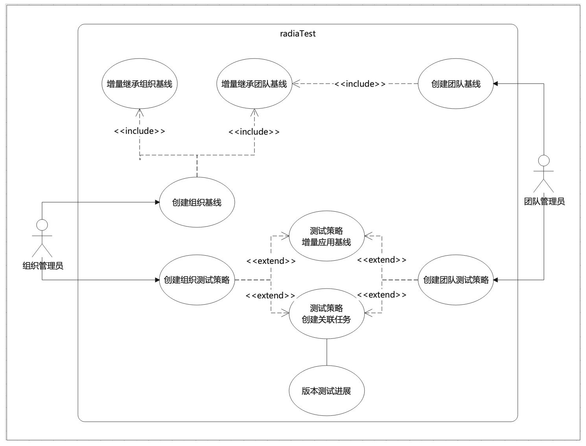
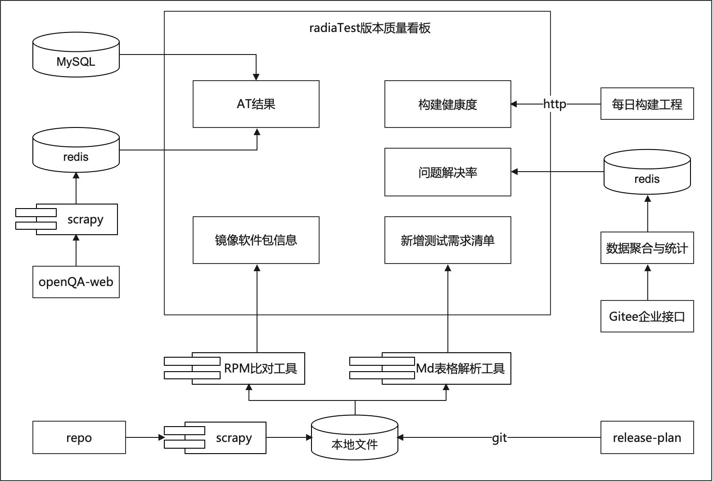
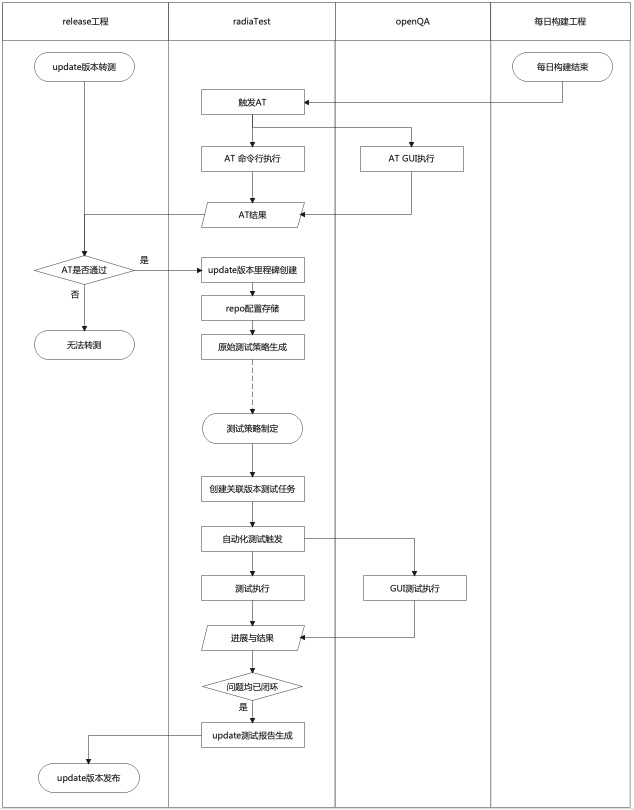

#  需求描述

对于update版本发布的测试环节依赖人工推动和管理，效率低；测试进展以及结果缺乏直观可视化入口；测试验证难跟踪追溯；update测试报告缺乏，且无法自动生成。

对于目前社区正在推动的众测活动，如开源实习、软件包加固等项目，当前仅可以通过社交软件进行与参与者的交流以及通过代码托管平台对验收交付过程进行承载，对于全流程而言无法高效跟踪与追溯。

对于手工测试而言，社区缺乏对测试过程的承载，仅记载了每一项手工测试的执行结果，无法完全支撑手工测试可信。

对于版本而言，因平台暂时不具备基线与策略的数据，令版本测试范围无法界定，测试进展无法跟踪，对于版本而言当前平台提供的功能较为有限。

为了解决上述问题，radiaTest测试管理平台需求在1230版本中：

1. 实现对版本各质量指标的统计与体现并连通版本发布工程实现质量可信；

2. 承载众测需求的发布跟踪验收流程，对接平台已有的任务管理泳道；

3. 新增手工测试看板，对手工用例执行过程进行统一存储；

4. 新增测试执行策略与其基线的管理，提升对于版本测试任务发布与跟踪的易用性。

## 1.1、 受益人

| 角色       | 角色描述                                     |
| ---------- | -------------------------------------------- |
| 测试人员   | 根据测试任务负责用例执行的人员               |
| 测试经理   | 负责管理版本、资源、测试任务的人员           |
| 版本QA     | 负责管理社区版本质量的人员                   |
| 社区开发者 | 参与社区软件包加固类等公开测试活动活动的人员 |

## 1.2、依赖组件

| 组件          | 组件描述           | 可获得性                        |
| ------------- | ------------------ | ------------------------------- |
| python3-devel | python3开发组件    | 使用openEuler repo源dnf install |
| nodejs        | JavaScript运行环境 | 从nodejs官网获取二进制包        |
| mariadb       | 关系型数据库       | 使用openEuler repo源dnf install |
| nginx         | web服务器          | 使用openEuler repo源dnf install |
| scrapy        | web抓取框架        | 使用openEuler repo源dnf install |

## 1.3、License

Mulan V2

# 2、 需求场景分析

## 2.1、用例视图

### 2.1.1、版本质量看板

- 基于版本基础的质量出口依据，需求直观化对问题解决率、测试需求清单、构建健康度、软件包变更识别、测试进展查询等数据进行查询，使能版本质量看护者直观快速的发现当前版本的未达标项，进入下一轮迭代或发布的质量出口严格把关。

- 识别的目标：

  - 平台管理员注册可供用户选择的全局检查项，即后端已支持比对的检查项
  - 测试经理对某版本的质量检查规则进行检查项的选择与配置，如检查项标准的高低、比对运算符等
  - 测试经理检查当轮迭代是否满足质量规则，识别没有达标的检查项
  - 达标后，测试经理令版本进入下一轮测试迭代
  - 社区开发者查询版本新增/继承测试需求清单查询
  - 社区开发者查询问题解决率（当前问题解决率、遗留问题数等）
  - 社区开发者查询软件包状况（everything/epol软件包范围变更、同名异构软件包版本号一致性检查）
  - 社区开发者查询版本测试进展（当前版本策略对应的用例集的测试进展）
  - 社区开发者查询构建健康度（每日构建结果、rpm check结果、AT结果）

  

### 2.1.2、update版本发布测试验证

- 对于原有的流程，每日构建成功后将会触发openQA相关的jenkins工程，触发由openQA执行的全量AT，此流程无法满足新版本AT策略（即GUI相关AT在openQA执行、命令行相关AT基于mugen测试套件完成），所以应当变更为每日构建工程触发平台向外提供的相应接口，提供AT的触发入口，并由平台完成AT用例的区分调度，以及提供结果查询；对于原有update版本发布而言，需要人工识别是否AT成功，再进行手动触发平台的后续测试验证流程，并且测试验证的结果同时也依赖于人工传递。因此平台新增查询AT结果的入口，以及生成并回传测试报告的出口，已支撑流程的全自动化。

- 识别的目标:

  - 每日构建成功后触发AT执行
  - 发布工程查询AT结果
  - 发布工程触发平台测试验证流程
  - 测试经理完善自动生成的原始测试策略
  - 测试经理调整与确认提交测试报告

  

### 2.1.3、众测承载

#### 2.1.3.1、需求中心

- 为了承载众测活动（以软件包加固项目与开源实习项目为基础），结合平台已有的任务管理页面，新增可公开发布众测需求的页面，用户可以在既定分数体系下自由参与众测活动。对于开发者而言，可以在记录、跟踪、及时反馈进展的同时，充分利用平台既有的资源池和文本用例管理功能，并且以此将众测活动涉及的交付件等资产永久化存储，增加社区对于众测活动的有效追溯。

- 识别的目标：

  - 组织管理员（QA-maintainer）发布需求
  - 个人/团队消耗个人/团队的影响力（积分）发布需求
  - 需求发布者验收需求
  - 需求发布者（团队发布）分配验收责任人
  - 个人/团队接受公开的需求
  - 需求接受者放弃正在进行的需求
  - 需求接受者（团队接受）分配软件包责任人
  - 需求接受者（团队接受）分配影响力（积分）奖励
  - 需求相关用户上传/下载附件（说明附件、进展附件、交付附件）

  

#### 2.1.3.2、用户体验优化

1. 加入用户组优化

   用户中心用户组页面区分显示组织下的全量用户组，为未加入用户组新增申请加入功能

2. 消息通知优化

   消息通知新增组织过滤，不允许跨组织推送

3. 重复登陆优化

   重复登录将主动失效前令牌，保证新令牌唯一有效

4. 页面布局优化

   将社区开发者高频使用的工作流相关页面集中在工作台下，以此实现页面布局的正交化，提升易用性。



### 2.1.4、手工测试IT化

- 提供手工测试过程持久化记录的载体，使能手工测试可信。

- 识别的目标：

  - 查询正在进行/历史的手工测试任务
  - 创建新的手工测试任务
  - 录入手工测试过程/结果内容（文字/截图）
  - 手工测试任务日志查询

  

### 2.1.5、测试基线与策略管理

- 测试策略数据项承载对应里程碑的测试分类、测试项、测试套件与用例全貌，体现版本测试执行范围，支撑版本测试进展的体现，而测试基线即策略的模板。对于组织（社区）而言，不仅可以应用自身定义的组织（社区）基线，还可以应用组织（社区）内团队公开的测试基线。

- 识别的目标：

  - 创建版本基线
  - 继承版本基线
  - 创建版本测试策略
  - 对既有策略应用版本基线
  - 创建关联的版本测试任务

  

## 2.2、需求分解

| no   | 1级需求            | 2级需求                                                      | 交付时间   |
| ---- | ------------------ | ------------------------------------------------------------ | ---------- |
| 1.   | 版本质量统计与展示 | 相同迭代同名易构软件包版本比对                               | 2022/10/30 |
|      |                    | 不同迭代EPOL软件包范围比对                                   | 2022/10/30 |
|      |                    | 每日构建与rpm check结果体现                                  | 2022/11/30 |
|      |                    | 迭代与里程碑变更为一对多，质量看板统计同迭代所有里程碑的总计 | 2022/11/30 |
| 2.   | 版本质量checklist  | 平台管理员全局检查项配置                                     | 2022/10/30 |
|      |                    | 用户版本质量检查规则设置                                     | 2022/10/30 |
|      |                    | 版本质量达标判断与规则一致                                   | 2022/10/30 |
| 3.   | update版本测试验证 | 最新每日构建AT结果查询                                       | 2022/11/30 |
|      |                    | 接受release工程触发update版本测试请求，创建原始测试执行策略，并自动应用基线 | 2022/10/30 |
|      |                    | update版本测试报告自动生成与转发                             | 2022/11/30 |
| 4.   | 需求中心           | 需求发布、验收、接受、放弃等数据事务                         | 2022/10/30 |
|      |                    | 需求同步创建关联任务，子需求同步创建关联子任务               | 2022/10/30 |
|      |                    | 需求说明、进展、验收附件的上传与下载                         | 2022/10/30 |
|      |                    | 需求进展反馈、编辑等数据事务                                 | 2022/10/30 |
| 5.   | 用户体验优化       | 作业流相关页面（需求-任务-测试）整合入工作台页面             | 2022/10/30 |
|      |                    | 用户申请加入任意同组织内的用户组                             | 2022/10/30 |
|      |                    | 消息通知区分组织                                             | 2022/10/30 |
|      |                    | 重复登陆后新令牌唯一有效                                     | 2022/10/30 |
| 6.   | 手工测试IT化       | 手工测试任务数据事务                                         | 2022/11/30 |
|      |                    | 文本用例步骤解析                                             | 2022/11/30 |
|      |                    | 测试步骤执行结果转储日志文件                                 | 2022/11/30 |
| 7.   | 测试基线与策略管理 | 基线/策略节点数据事务                                        | 2022/10/30 |
|      |                    | 对已有策略/基线节点增量应用已有结构                          | 2022/10/30 |
|      |                    | 测试策略创建关联版本任务                                     | 2022/11/30 |

# 3、模块设计

## 3.1、版本质量看板

1. AT结果由mugen测试套件以及openQA两部分组合而成。对于openQA执行结果，通过openQA-server的web端利用scrapyspider爬虫获取，结果存于redis中；对于mugen测试套件的AT执行结果，则通过job_id获取结果，并于返回前端前完成数据整合。
2. 不同迭代/发布版本的相应Packages信息通过scrapyspider爬取并转化为纯文本文件存储rpm全名列表，通过rpm比对工具进行软件包范围变更、同名异构版本一致性的查询。
3. 提供外部接口接收每日构建工程每一次的rpm_check和构建结果数据，进行数据结构解析处理后供web端进行展示。
4. 新增测试需求清单来源于release-management仓库的release-plan文件，通过git获取，并利用md转html工具进行解析和表格数据读取。
5. 通过celery异步定时计算同迭代所有关联企业仓里程碑的若干问题解决率指标，并存结果于redis便于查询。
6. 原表关系，product->milestone，为一对多关系；新增round后，实现表关系为：product->round，一对多，round->milestone，一对多，milesone中增减round的主键外键关联；



## 3.2、update版本发布测试验证

1. 基于平台已有的框架适配器编写openQA执行器，将GUI用例关联于openQA框架，执行测试时实现自动区分。
2. update版本转测自动创建的原始测试策略自动应用update版本的测试基线。
3. 基于设计的update测试报告模板自动填充量化客观内容，通过http请求/邮件将报告发送于Majun-版本发布模块/指定用户。



## 3.3、需求中心

## 3.4、手工测试看板

1. 数据库中文本用例数据的存储并未区分步骤，用例内容以LONGTEXT格式进行存储，但文本用例存在通用的标准编写格式。文本用例步骤解析模块基于步骤模式正则匹配进行用例步骤划分。

2. 手工测试任务的过程/结果录入为同时存在文本与图片的富文本内容，通过日志生成模块将富文本内容转换为yaml格式，图片附件与日志文件通过rsync发往repo服务器同路径存储，日志文件的下载链接存储与服务端MySQL数据库相应测试Job的数据体中。

   

## 3.5、测试基线与策略管理

1. 测试基线与测试策略继承用例管理的数据存储结构，同样基于case_node表存储父子关系。

2. 测试基线的继承与测试策略应用测试基线，以节点复制后的增量挂载为逻辑基础（不共有的同级节点直接递归新增，共有的同级节点往下遍历继续增量挂载）

   

# 4、 质量属性设计

## 4.1、 性能规格

| 规格名称     | 规格指标 |
| ------------ | -------- |
| 接口响应时间 | 2000ms内 |

## 4.2、 系统可靠性设计

1. 数据库：

   基于华为云提供的具备完善主备机制的持久化/缓存数据库，保障数据可靠性。

2. 异常情况：

   真实节点部署：基于docker-compose工具以及supervisord服务对异常关闭的服务进行自动重启。

   kubernetes-pod部署：基于k8s实现弹性扩容和异常关闭自动重启。

3. 数据库部署：

   持久化/缓存数据库单独部署在独立存储节点，使用更大的带宽，保障对主数据库的访问不因流量高峰阻塞

4. 多请求并发场景处理方：

   web服务分布式部署于多个节点，通过负载均衡支撑高流量场景；使用gunicorn（多进程+gevent协程）启动web后端应用，支撑处理高并发场景。处理时间高于秒级的接口利用celery实现异步并发，支撑平台秒级响应。

## 4.3、 安全性设计

- 数据库依赖于华为云的数据库服务，由华为云提供成熟的KMS密钥管理服务
- 密文传输采用RSA256非对称加密，避免后端服务传输密文过程中遭遇数据劫持
- 对外服务采用https协议通信
- 权限管理模块纳管所有接口，最小粒度保证访问合法

## 4.4、 兼容性设计

- 通过统一API Gateway访问第三方平台的服务，屏蔽第三方平台中复杂的调用关系。

- 对外接口只能增量变化，新版本保证旧版本接口可用。

- 采用ORM，数据库的变更对外不体现，由代码逻辑保证可用性。

## 4.5、 可服务性设计

## 4.6、 可测试性设计


# 5、外部接口清单

## 5.1、 web restful接口清单

| 序号 | 接口名称                         | 类型 | 说明                         |
| ---- | -------------------------------- | ---- | ---------------------------- |
| 1.   | /api/v1/openeuler/at             | GET  | 获取最新每日构建镜像的AT结果 |
| 2.   | /api/v1/openeuler/at             | POST | 触发AT测试执行               |
| 3.   | /api/v1/openeuler/update/testing | POST | update版本测试验证触发       |

### 5.1.1、/api/v1/openeuler/at

- 查询每日构建镜像的AT结果

- HTTP请求方式：GET

- 数据提交方式：application/json

- 请求参数：

  | 参数名  | 必选 | 类型 | 说明   |
  | ------- | ---- | ---- | ------ |
  | product | true | str  | 产品名 |
  | version | true | str  | 版本名 |

- 请求参数示例：

  ```json
  {
  	“product”: "openEuler",
    "version": "20.03-LTS-SP1",
  }
  ```

  

- 返回体参数：

  | 参数名           | 类型 | 说明              |
  | ---------------- | ---- | ----------------- |
  | error_code       | int  | 返回码            |
  | error_msg        | str  | 返回信息          |
  | data             | List | 当天所有的AT结果  |
  | build            | str  | 构建名            |
  | finish_timestamp | int  | AT完成的时间戳    |
  | total            | int  | 用例总数          |
  | running          | int  | 正在执行的用例数  |
  | success          | int  | 成功的用例数      |
  | block            | int  | 阻塞/跳过的用例数 |
  | failure          | int  | 失败的用例数      |

- 返回示例：

  ```json
  {
    "error_code": 2000,
    "error_msg": "OK",
    "data": [
      {
        "build": "Build-2022-10-27-12-00-12",
        "finish_timestamp": 1666815293,
        "total": 19,
        "running": 3,
        "success": 16,
        "block": 0,
        "failure": 0
      },
      {
        "build": "Build-2022-10-27-18-15-21",
        "finish_timestamp": 1666839293,
        "total": 20,
        "running": 3,
        "success": 16,
        "block": 0,
        "failure": 1
      },
    ]
  }
  ```

  | 状态码 | 场景                     | 提示信息                                |
  | ------ | ------------------------ | --------------------------------------- |
  | 200    | 请求数据已通过数据校验   | 见返回体参数                            |
  | 400    | 请求数据没有通过数据校验 | validation_error["字段1"，"字段2", ...] |

### 5.1.2、/api/v1/openeuler/at

- 根据镜像信息触发AT测试

- HTTP请求方式：POST

- 数据提交方式：application/json

- 请求参数：

  | 参数名 | 必选 | 类型 | 说明        |
  | ------ | ---- | ---- | ----------- |
  | iso    | true | str  | 镜像url地址 |
  | build  | true | str  | 构建名      |

- 请求参数示例：

  ```json
  {
  	“iso”: "http://xxx/openEuler-20.03-LTS-SP1-aarch64-dvd.iso",
    "build": "Build-2022-10-27-18-15-21"
  }
  ```

  

- 返回体参数：

  | 参数名     | 类型 | 说明     |
  | ---------- | ---- | -------- |
  | error_code | int  | 返回码   |
  | error_msg  | str  | 返回信息 |

- 返回示例：

  ```json
  {
    "error_code": 2000,
    "error_msg": "OK",
  }
  ```

  | 状态码 | 场景                     | 提示信息                                |
  | ------ | ------------------------ | --------------------------------------- |
  | 200    | 请求数据已通过数据校验   | 见返回体参数                            |
  | 400    | 请求数据没有通过数据校验 | validation_error["字段1"，"字段2", ...] |

### 5.1.3、/api/v1/openeuler/update/testing

- update版本测试验证触发，触发后将自动生成相应update版本的原始测试执行策略。

- HTTP请求方式：POST

- 数据提交方式：application/json

- 请求参数：

  | 参数名          | 必选  | 类型      | 说明         |
  | --------------- | ----- | --------- | ------------ |
  | product         | true  | str       | 产品名       |
  | version         | true  | str       | 版本名       |
  | base_update_url | true  | HttpUrl   | update源地址 |
  | epol_update_url | False | HttpUrl   | epol源地址   |
  | pkgs            | true  | List[str] | 待验证包列表 |

- 请求参数示例：

  ```json
  {
  	“product”: "openEuler",
    "version": "20.03-LTS-SP1",
    "base_update_url": "http://121.36.84.172/repo.openeuler.org/openEuler-20.03-LTS-SP1/update_20210914/",
    "epol_update_url": "http://121.36.84.172/repo.openeuler.org/openEuler-20.03-LTS-SP1/EPOL/update_20210914/",
    "pkgs": ["jq", "abrt", "Judy"], 
  }
  ```

  

- 返回体参数：

  | 参数名     | 类型 | 说明     |
  | ---------- | ---- | -------- |
  | error_code | int  | 返回码   |
  | error_msg  | str  | 返回信息 |

- 返回示例：

  ```json
  {
    "error_code": 2000,
    "error_msg": "OK"
  }
  ```

  | 状态码 | 场景                     | 提示信息                                |
  | ------ | ------------------------ | --------------------------------------- |
  | 200    | 请求数据已通过数据校验   | 见返回体参数                            |
  | 400    | 请求数据没有通过数据校验 | validation_error["字段1"，"字段2", ...] |


# 6、修改日志

| 版本 | 发布说明 |
| ---- | -------- |
|      |          |


# 7、参考目录