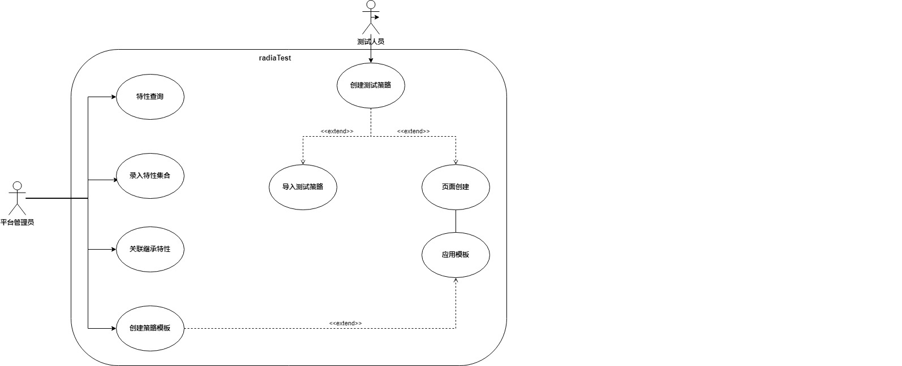
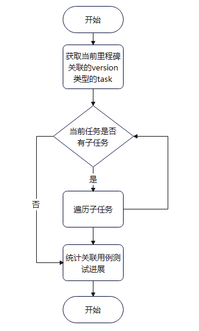
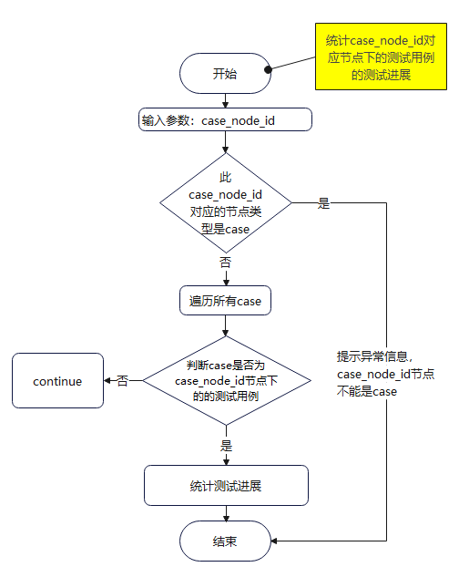
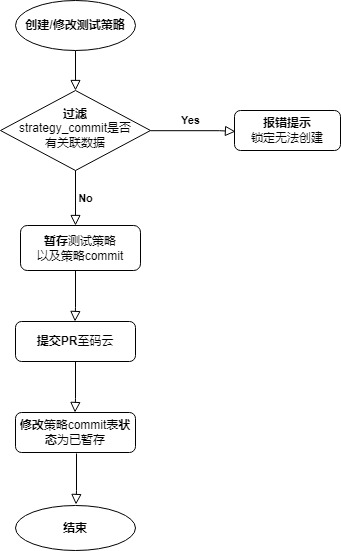
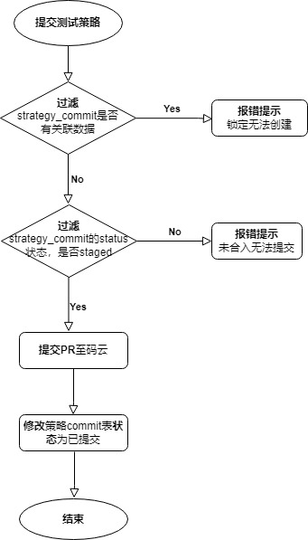
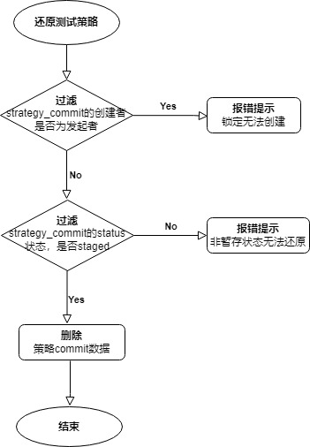
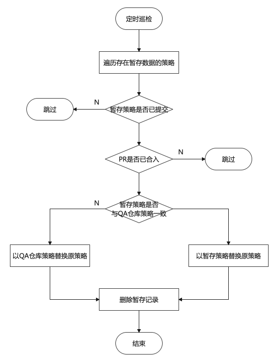
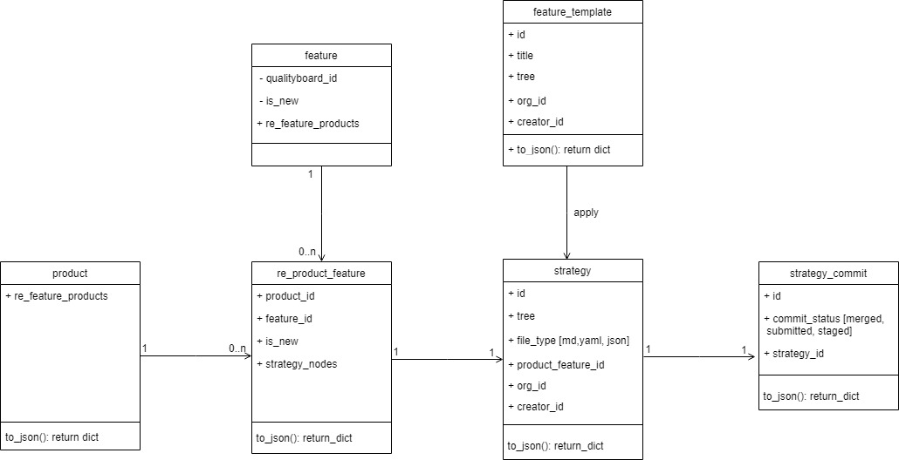
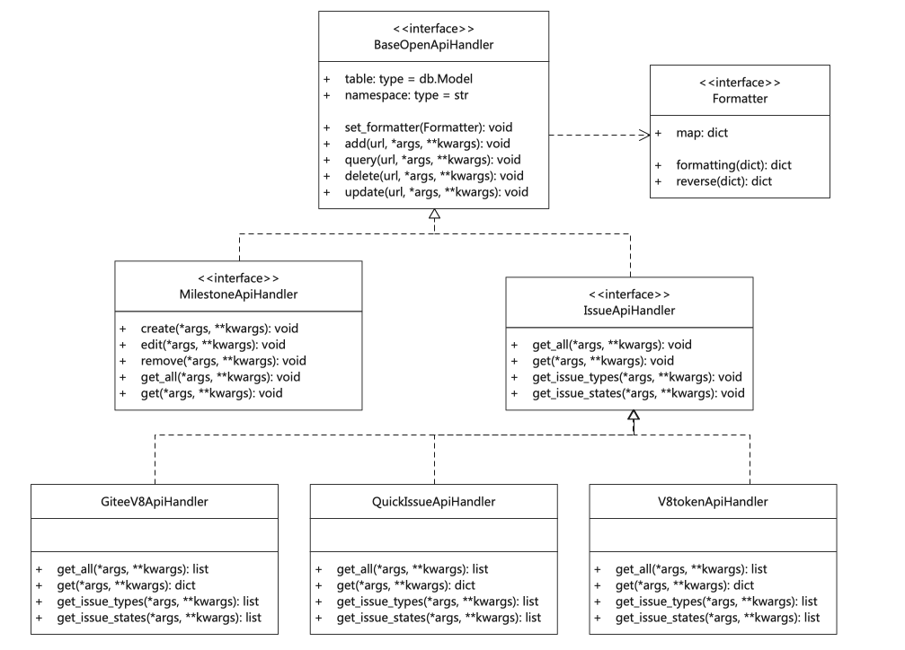

#  需求描述

基于radiaTest平台的半年运作总结，用户体验上，基于码云企业仓鉴权登陆十分繁琐，也并非所有社区开发者可以审批加入码云企业仓，导致平台使用门槛十分得高。且因为和码云OAuth2鉴权绑定的关系，导致平台与码云强耦合，不利于登陆鉴权模块未来可能的拓展。

对于质量看板而言，当前缺乏用例执行进展跟踪，版本质量、测试任务、用例执行没有实际串成一条线，社区版本质量看护无法直接感知到用例层级。

在openEuler 22.03 LTS SP1以及之前的版本中，社区测试策略仅通过QA仓库收集，效率有限且社区参与度有限。除此之外，QA仓库的承载方式因需要便于PR审阅，仅支持markdown形式，无法以如脑图的形式直观承载。

根据社区团队版本测试中反馈的需求，因测试任务当前没有关联问题单，测试经理无法直观感知当前任务（子任务）所涉及的问题单数量与进展，使得测试任务管理并没有完全实现任务的全量IT化承载，测试经理仍需本地以表格形式重复记录，削弱了平台统一承载带来的效率提升。

因此，radiaTest测试管理平台需要：

1. 重构登陆鉴权逻辑，使能各组织/社区采用多元化鉴权方式
2. 质量看板新增版本基线用例测试进展展示，支撑以版本视角看护用例执行状况；
3. 使能测试设计IT化承载，提供组织/社区测试策略归档入口；
4. 修改问题单提交入口，支持对测试任务所关联的问题单数据的统计；

## 1.1、 受益人

| 角色       | 角色描述                                     |
| ---------- | -------------------------------------------- |
| 测试人员   | 根据测试任务负责用例执行的人员               |
| 测试经理   | 负责管理版本、资源、测试任务的人员           |
| 版本QA     | 负责管理社区版本质量的人员                   |
| 社区开发者 | 参与社区软件包加固类等公开测试活动活动的人员 |

## 1.2、依赖组件

| 组件          | 组件描述           | 可获得性                        |
| ------------- | ------------------ | ------------------------------- |
| python3-devel | python3开发组件    | 使用openEuler repo源dnf install |
| nodejs        | JavaScript运行环境 | 从nodejs官网获取二进制包        |
| mariadb       | 关系型数据库       | 使用openEuler repo源dnf install |
| nginx         | web服务器          | 使用openEuler repo源dnf install |

## 1.3、License

Mulan V2

# 2、 需求场景分析

## 2.1、用例视图

### 2.1.1、用户鉴权重构

- 组织可自定义用户登陆该组织时所需鉴权服务(oneid/gitee/...)，平台对于码云的直接交互全量修改为间接交互，使能radiaTest与码云实现解耦
- 识别的目标：

  - 鉴权服务多元化
    - 支持oneid鉴权登陆
    - 组织注册/编辑时指定鉴权服务

  - 基于quickissue查询issue
  
  - 基于v8token操作企业仓里程碑
- 用例视图:
    
  
    

### 2.1.2、版本基线用例执行进展

- 于质量看板中基于当前产品的版本基线涉及的用例范围，通过对测试任务关联用例的执行统计，展示该用例范围的执行进展

- 识别的目标:

  - 基于对应版本基线用例结构查询各级目录用例执行情况
  
- 用例视图:

  

### 2.1.3、测试设计IT化

- 于工作台新增测试设计页面，基于可管理的社区特性集对版本/特性测试策略文档IT化管理，间接对接码云接口实现同步修改，使能承载社区测试策略设计

- 识别的目标:

  - 对全量特性集的数据操作
  
  - 版本继承特性基于全量特性集关联创建
  
  - 对未合入版本/特性测试策略的数据操作
  
  - 导入/导出markdown格式测试策略文件
  
  - 对已合入版本/特性测试策略的数据操作（同步QA仓提交PR）
  
  - 版本/特性测试策略是否已合入定时巡检
  
- 用例视图:
  
  

### 2.1.4、任务关联问题单

- 问题单提交入口迁移至测试任务详情，以软件包为单位提交问题单（牵引社区于平台提交问题单），支持任务中统计关联问题单总数

- 识别的目标:

  - 基于任务关联的测试套向可编辑的目的地址提交问题单
  
  - 自动记录已提交的问题单链接
  
  - 统计已记录的任务关联问题单数目
  
- 用例视图:

  

## 2.2、需求分解

| no   | 1级需求              | 2级需求                                          | 交付时间 |
| ---- | -------------------- | ------------------------------------------------ | -------- |
| 1.   | 用户鉴权重构         | 支持基于oneid鉴权，适配oneid接口与响应体数据结构 |          |
|      |                      | 登陆逻辑重构，变量命名整改                       |          |
|      |                      | 组织注册提供鉴权服务选择，衰退企业仓鉴权         |          |
|      |                      | issue查询对接quickissue服务                      |          |
|      |                      | 码云企业仓接口交互对接v8token服务                |          |
| 2.   | 版本基线用例执行进展 | 可识别全量版本关联用例                           |          |
|      |                      | 用例执行进展分层结构与版本基线分层结构一致       |          |
|      |                      | 可对每一级分层所涉及用例的执行情况进行统计       |          |
| 3.   | 测试设计IT化         | 支持对组织下全量特性集的数据操作                 |          |
|      |                      | 版本继承特性基于特性集关联                       |          |
|      |                      | 支持对未合入QA仓库的版本/特性测试策略的数据操作  |          |
|      |                      | 支持基于已合入QA仓库的测试策略向QA仓库提交PR     |          |
|      |                      | 具备测试策略是否已合入的判断巡检功能             |          |
|      |                      | 支持markdown格式测试策略的导入和导出             |          |
| 4.   | 测试任务关联问题单   | 支持向可编辑的目的仓库提交问题单                 |          |
|      |                      | 任务自动记录已提交的问题单数据                   |          |
|      |                      | 任务实时统计已记录的问题单数目                   |          |

# 3、模块设计

## 3.1、用户鉴权重构

### 3.1.1 影响面分析

- 涉及表
  表名:user,re_user_role,re_user_group,re_user_orgnization,requirement_publisher,requirement_acceptor,requirement_package,baseline_template,

  base_node,template,group,framework,git_repo,celerytask,product,milestone,task,task_comment,task_status,task_report_content,distribute_template_type,machine_group,pmachine,case_node,baseline,suite,case,commit,commit_comment,vmachine.共计30张表.(备注:关联外键字段gitee_id变更为user_id,代码层表字段变更同上)

- 涉及代码
  使用gitee_id的代码，统一更换为user_id.

- 涉及资源
  对于数据库信息更新两种方案:
  (1) 使用中间表,对原来已注册资源进行id变换更新.(提供test环境优先获取用户oneid信息,与生产数据对应起来,形成中间表,批量更新注册资源)
  (2) 原始已注册资源释放,用户重新注册资源。

### 3.1.2 变更表字段设计

| 表名         | 原字段      | 新字段名                | 说明                                                   |
| ------------ | ----------- | ----------------------- | ------------------------------------------------------ |
| user         | gitee_id    | user_id                 | 既定鉴权平台用户id与鉴权来源以下划线拼接.(例123_oneid) |
|              | gitee_login | user_login              | 登录使用的三方鉴权机构提供的用户名                     |
|              | user_name   | user_name               | 登录使用的三方鉴权机构提供的用户名                     |
| organization |             | authority               | 新增鉴权机构                                           |
|              |             | oauth_login_url         | 新增三方应用的登录地址                                 |
|              |             | oauth_get_token_url     | 新增使用code请求三方应用获取token地址                  |
|              |             | oauth_get_user_info_url | 新增获取用户在第三方应用平台的信息                     |

### 3.1.3 登录流程设计

#### 3.1.3.1 登录跳转至鉴权机构

(1) 区别鉴权机构:不同鉴权机构对scope值的处理不同,需要区分处理.

#### 3.1.3.2 鉴权机构回调radiaTest平台

（1）请求获取token信息：变更token请求url硬编码

（2）请求获取用户信息：变更用户基本信息获取url硬编码

（3）鉴权平台用户id处理：鉴权平台返回的用户id与鉴权平台名以下划线拼接,生成radiaTest平台用户id

（4） 缓存鉴权机构token：Rediskey涉及gitee_id变量名，全部变更为user_id，gitee_user变更为oauth_user

（5）返回用户信息的解析映射：区分不同平台返回的用户信息字典，解析字典值与平台用户表内字段信息一一对应。

#### 3.1.3.3 用户信息入库

（1）不再缓存用户的access_token与refresh_token，与码云的交互，采用v8token交互。

### 3.1.4 接口设计

#### 3.1.4.1 注册组织接口

  说明:管理员新增组织,并添加鉴权方式,返回组织id.

  内部接口:def  handler_save_org(body: Addschema, avatar: FileStorage) -> jsonify(error_code=...,error_msg=..,data=..)

  Addschema:

| 参数名                  | 必选                     | 类型 | 说明                                   |
| ----------------------- | ------------------------ | ---- | -------------------------------------- |
| name                    | true                     | str  | 组织名称                               |
| description             | false                    | str  | 组织描述                               |
| avatar_url              | false                    | str  | 组织头像                               |
| authority               | true                     | List | gitee/oneid                            |
| enterpise_id            | true(选择绑定企业仓必选) | int  | 企业仓id                               |
| enterprise_join_url     | false                    | str  | 申请加入企业仓地址                     |
| oauth_login_url         | true                     | str  | 三方应用的登录地址                     |
| oauth_client_id         | true                     | str  | 第三方平台注册的应用id                 |
| oauth_client_secret     | true                     | str  | 第三方平台注册的应用密码               |
| oauth_scope             | false                    | list | 在第三方平台的作用域                   |
| oauth_get_token_url     | true                     | str  | 使用code请求三方应用获取token地址      |
| oauth_get_user_info_url | true                     | str  | 获取用户在第三方应用平台的信息请求地址 |
| cla_verify_url          | false                    | str  | cla验证地址                            |
| cla_verify_params       | false                    | str  | cla验证请求url中的参数                 |
| cla_verify_body         | false                    | str  | cla验证请求中body中的参数              |
| cla_sign_url            | false                    | str  | cla签署地址                            |
| cla_request_type        | false                    | str  | cla验证请求方式                        |
| cla_pass_flag           | false                    | str  | cla验证通过标志                        |

#### 3.1.4.2 radiaTest登录跳转鉴权平台

说明:用户在radiaTest平台点击登录,跳转鉴权平台.

内部接口:def  handler_oauth_login(query: OauthLoginSchema) -> jsonify(error_code=...,error_msg=..,data=..)

OauthLoginSchema:

| 参数名 | 必选 | 类型 | 说明   |
| ------ | ---- | ---- | ------ |
| org_id | true | int  | 组织id |

#### 3.1.4.3 鉴权机构回调radiaTest登录

说明:用户在三方鉴权机构登录后，三方鉴权机构回调radiatest平台登录,radiaTest平台对登录信息处理.不同鉴权回传的用户信息字段不同,需要映射为平台统一的字段.

内部接口:def  handler_login_callback(query: LoginSchema) -> jsonify(error_code=...,error_msg=..,data=..)

LoginSchema:

| 参数名 | 必选 | 类型 | 说明                 |
| ------ | ---- | ---- | -------------------- |
| org_id | true | int  | 组织id               |
| code   | true | str  | 鉴权平台登录后的code |

## 3.2、版本基线用例执行进展

### 3.2.1、业务流程图

- 统计测试任务进展-流程图

  统计关联用例测试进展包括下面一个步骤：获取测试用例测试结果和相关上层节点信息

  

- 获取测试用例测试结果和相关上层节点信息-流程图

  

- 按节点统计测试用例测试结果--流程图

## 3.3、测试设计IT化

#### 3.3.1、支持对组织下全量特性集的数据操作

  平台存储组织下全量特性集的数据，用户可对CRUD特性集数据，具体包括以下内容：

- 支持对组织下全量特性集的数据操作
  - 组织下全量特性集树状结构展示
  - 组织下用户自定义CURD全量特性集
  - ps：当前设计特性集数据，部分来源于用户录入，部分来源于外部数据同步。未来特性集数据可能全量更改为数据同步；

#### 3.3.2、版本继承特性基于特性集关联

  平台存储在组织下全量特性集的数据，用户在某一产品下可关联成为该产品的继承特性；

- 版本继承特性基于特性集关联
  - 版本下关联的继承特性树状结构展示
  - 用户自定义关联组织下特性集
    - 继承特性测试策略脑图设计
    - 继承特性测试模板应用

#### 3.3.3、支持对未合入QA仓库的版本/特性测试策略的数据操作

  对未合入QA仓库的版本/特性测试策略，平台支持操作版本/特性测试策略数据，给用户提供持续存储以及一站式IT化功能；

- 测试策略模板制定
  用户可自定义设计测试策略模板，平台将存储设计模板，为用户提供一次设计，可多次复用的功能。
  
- 测试设计业务IT化
  - 特性集合树状结构展示

  - 特性测试策略模板应用 

    - 对于已经设计好的测试策略模板，用户可应用此测试策略模板，平台会将模板节点同步复制到该测试策略下；

  - 特性测试策略脑图创建、设计等
    - 平台对测试策略提供脑图展示，脑图设计等功能
    - 平台提供对脑图的创建/修改，提交，还原功能
    - 创建/修改流程

    

    - 提交流程
    
    
    
    - 还原流程
    
      

#### 3.3.4、支持基于已合入QA仓库的测试策略向QA仓库提交PR

  对已合入QA仓库的版本/特性测试策略，平台支持提交PR到QA仓库，以便用户进行版本管理；

- 支持对已合入的版本/特性测试策略，提交PR
  - 通过跟码云交互的接口，以公共身份向QA仓库提交PR
  - 记录当前PR地址
  - 记录sig-QA当前版本地址

#### 3.3.5、具备测试策略是否已合入的判断巡检功能

  对测试策略是否已合入进行巡检，检测是否达到可合入标准；

- 支持对测试策略是否已合入的判断巡检功能
  - 平台对测试策略是否合入QA仓库，通过定期巡检任务进行判断处理，若对应PR已合入，且策略内容与QA仓库中一致，将解锁对应策略

  

#### 3.3.6、支持markdown格式测试策略的导入和导出

- 支持markdown格式测试策略的导入和导出
  - 支持markdown格式测试策略的导入
    - 平台支持markdown格式测试策略的导入作为脑图关键内容的输入项；
      - md转换成html格式后，对h(n)标签，以及table标签进行检索，导入；
    - 具体分析：
      - 参考utils里面md_util.py工具类中get_md_tabled2html(md_contend)方法，
        通过将md类型转换成html后，对etree进行xpath检索，对应h(n)以及table的element，进而获取到相应数据；
      - 参考qualityboard下的handlers.py中，FeatureHandler类下的resolve方法，进一步将html的table数据，转换成dict；
      - 对tree字段进行关联关系以及内容的拼接，存入数据库；
  - 支持markdown格式测试策略的导出
    平台支持markdown格式测试策略的导出，将用户在平台编辑好的测试策略脑图导出存储为用户可使用的脑图格式；
    解析tree数据，按照既定模板导出文件。
    - 具体分析：
      - 对tree字段进行解析，解析出对应table以及h(n)内容；
      - 将对应table以及h(n)内容，按照父子关系，写入新建md文件中；

#### 3.3.7、测试设计模块表结构类图

## 3.4、测试任务关联问题单

- 创建问题过程依赖一个特性变更：对码云接口的直接交互的逻辑进行重构，使能兼容多种交互方式

  - 消息体格式转换改写为插件形式，关系变更为依赖
  - 定义接口层，支撑不同请求方式的实现

  

- 通过仓库名称获取仓库id，首次获取的仓库id将会存错于redis中，减少接口查询次数（缓存以提升查询性能）

  - 通过quickissue查询待提交问题的相关信息
  - 通过v8token服务创建问题单
  - 本地数据库存储问题单数据，与测试任务进行关联
  - 对测试任务关联问题单进行统计

# 4、 质量属性设计

## 4.1、 性能规格

| 规格名称     | 规格指标 |
| ------------ | -------- |
| 接口响应时间 | 2000ms内 |

## 4.2、 系统可靠性设计

1. 数据库：

   基于华为云提供的具备完善主备机制的持久化/缓存数据库，保障数据可靠性。

2. 异常情况：

   真实节点部署：基于docker-compose工具以及supervisord服务对异常关闭的服务进行自动重启。

   kubernetes-pod部署：基于k8s实现弹性扩容和异常关闭自动重启。

3. 数据库部署：

   持久化/缓存数据库单独部署在独立存储节点，使用更大的带宽，保障对主数据库的访问不因流量高峰阻塞

4. 多请求并发场景处理方：

   web服务分布式部署于多个节点，通过负载均衡支撑高流量场景；使用gunicorn（多进程+gevent协程）启动web后端应用，支撑处理高并发场景。处理时间高于秒级的接口利用celery实现异步并发，支撑平台秒级响应。

## 4.3、 安全性设计

- 数据库依赖于华为云的数据库服务，由华为云提供成熟的KMS密钥管理服务
- 密文传输采用RSA256非对称加密，避免后端服务传输密文过程中遭遇数据劫持
- 对外服务采用https协议通信
- 权限管理模块纳管所有接口，最小粒度保证访问合法

## 4.4、 兼容性设计

- 通过统一API Gateway访问第三方平台的服务，屏蔽第三方平台中复杂的调用关系。

- 对外接口只能增量变化，新版本保证旧版本接口可用。

- 采用ORM，数据库的变更对外不体现，由代码逻辑保证可用性。

## 4.5、 可服务性设计

## 4.6、 可测试性设计

# 5、修改日志

| 版本 | 发布说明 |
| ---- | -------- |
|      |          |

# 6、参考
