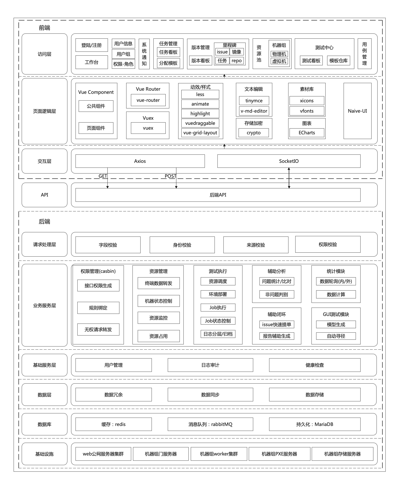
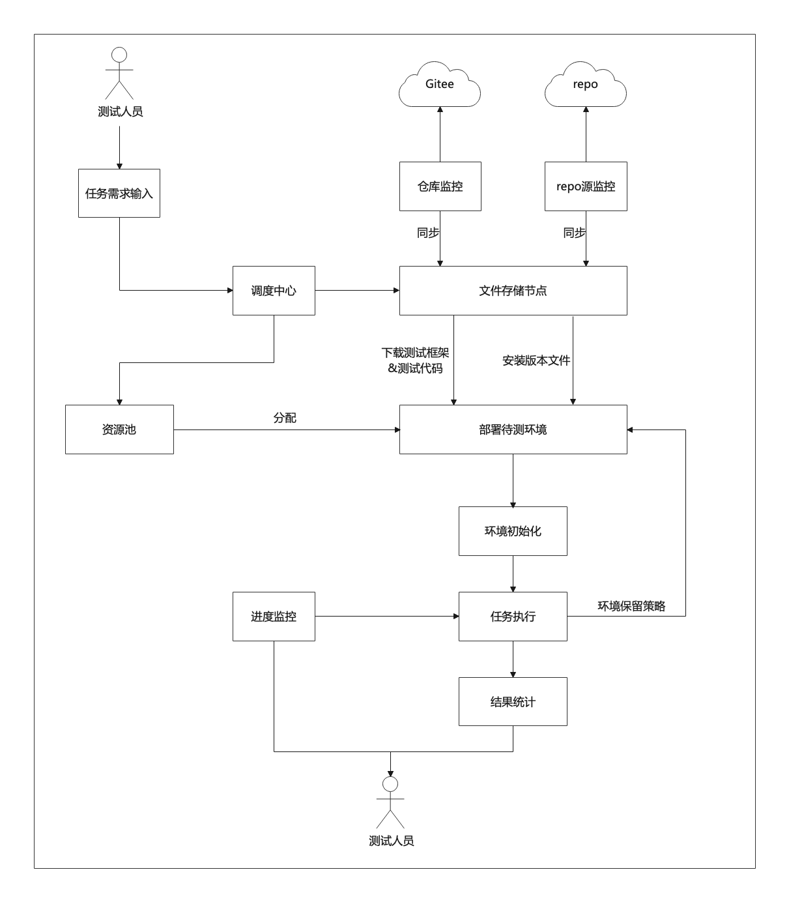

#  需求描述

​	鉴于质量要求，openEuler的update版本当前CVE修复验证和发布以周为单位，频率较高。且openEuler迭代版本的测试尤其环境部署及执行方面是半自动化的，缺少一套对环境、版本规划测试任务及任务执行、文本测试用例管理、以及测试开发日和bug发现日的系统平台。除此之外，统信测试人员一直询问社区是否接收文本测试用例，但社区目前不具备对文本测试用例的管理能力。

​	当前openEuler维护3个版本LTS、LTS-SP1、LTS-SP2的update发布，需要投入2.5人月人力，但未来随着SP3的发布，对测试人力的占用会更大。在版本测试中，虽然自动化率已经达到90%，但是实际版本测试活动中，一套环境的部署还是手动(ISO镜像下载大概5小时以上，物理机安装部署大概半小时)或者半自动化(虚拟机部署15分钟)。自动化用例的执行还需要手动进行代码下载、执行及结果的统计与分析，仍有效率提升的空间。除此之外，版本迭代测试任务没有统一的任务过程跟踪及整体管理体系。综上所述，开展各类社区测试活动缺少一个可支持的测试平台。

​	radiaTest测试平台可以满足openEuler各类版本的实际测试需求，以版本、资源、任务、执行、用例五个维度使能高效测试活动。可以根据实际版本测试任务，进行测试任务的定制，并与里程碑相关联，方便版本测试的跟踪管理。可以满足社区对文本用例的管理。可提供分布式的资源管理、测试任务管理能力。为未来规划的社区测试开放日、bug发现日等活动提供测试平台能力。

​	高效性使版本测试人力投入得以节省，易用性使社区吸引更多其他开发者（OSV&个人）向社区贡献，并且社区化的测试管理使社区测试生态不断提升。


## 1.1、 受益人

| 角色     | 角色描述                           |
| -------- | ---------------------------------- |
| 测试人员 | 根据测试任务负责用例执行的人员     |
| 测试经理 | 负责管理版本、资源、测试任务的人员 |

## 1.2、依赖组件

| 组件           | 组件描述           | 可获得性                        |
| -------------- | ------------------ | ------------------------------- |
| python3-devel  | python3开发组件    | 使用openEuler repo源dnf install |
| docker         | 容器引擎           | 使用openEuler repo源dnf install |
| docker-compose | 容器部署工具       | 使用openEuler repo源dnf install |
| tar            | 归档打包组件       | 使用openEuler repo源dnf install |
| nodejs         | JavaScript运行环境 | 从nodejs官网获取二进制包        |
| libvirt        | 虚拟化组件         | 使用openEuler repo源dnf install |
| virt-install   | 虚拟化组件         | 使用openEuler repo源dnf install |
| ipmitool       | bmc远程操作工具    | 使用openEuler repo源dnf install |
| mariadb        | 关系型数据库       | 使用openEuler repo源dnf install |
| nginx          | web服务器          | 使用openEuler repo源dnf install |
| rsync          | 日志同步工具       | 使用openEuler repo源dnf install |


## 1.3、License

Mulan V2

# 2、设计概述

## 2.1、 分析思路

<!--待补充，内容应为设计思想之类的抽象性内容-->

## 2.2、设计原则

- 前后端分离：前后端代码技术上进行分离，两者基于设计好的数据接口交互，使项目开发和测试并行推进。
- 数据与代码分离：将需求动态改变的数据提取到配置文件，而非用硬编码写死在代码中
- 接口与实现分离：外部依赖模块接口而非依赖模块实现
- 模块划分：模块之间只能单向调用，不能存在循环依赖

# 3、 需求分析

<!--待补充，内容应为得到架构设计内容的前因或者逻辑链前链-->

## 3.1、架构设计

#### 3.1.1、radiaTest平台软件架构

radiaTest采用前后端分离的模式，前端采用vue3框架js实现，后端采用flask框架python实现，通过http请求和websocket进行通信。

- UI主色为克莱因蓝#012fa6，辅色为浅灰色#f2f2f2，背景色为白色#ffffff。
- web页面通过Nginx进行部署，通过反向代理访问后台服务http接口，websocket涉及多对象，采取直连。
- 采用ORM的数据存储架构，牺牲部分性能保证安全性和代码的低编写门槛。
- 权限角色管理采用Casbin框架，权限为基于接口访问动作的权限，不涉及页面的组件过滤。页面的内容过滤通过强逻辑硬性过滤。
- 用户身份统一来源于Gitee身份鉴权，自身仅构建平台管理员的身份鉴别能力。
- 数据存储（持久化/缓存）采用主备机制，分布式部署，增加平台数据鲁棒性
- 消息队列为节点本地的异步任务队列，不涉及非本机通信
- 平台具备相对完整的日志审计和健康检查的体系，支撑运维。



#### 3.1.2、radiaTest部署架构

radiaTest主体为web服务的前后端模块，辅以部署于接入网段入口节点的转发服务和部署于工作节点的worker服务。

- web服务的前后端模块分别对应源码结构中的radiaTest-web和radiaTest-server，转发服务为radiaTest-messenger，worker服务为radiaTest-worker。
- radiaTest-web、radiaTest-server、radiaTest-messenger以容器进行部署，radiaTest-worker以supervisord直接部署在裸金属节点。
- messenger + N*worker即为平台接入的单个模块机器组，可复数接入，对worker实际发送请求对来源为转发服务messenger。
- messenger需要部署于机器组具备公网通信能力的节点上，确保与server端的一对一安全通信。每一个机器组都支持使用自身的dhcp和pxe服务等服务


##### 3.1.2.1、基于平台自有服务、单机器组接入的部署视图

<!--素材处于黄区，待补充-->

##### 3.1.2.2、基于多元化测试服务、多机器组接入的部署视图


### 3.2.1 用户管理

#### 3.2.1.1 用户鉴权

- 模块介绍

  平台中注册的组织拥有是否具备Gitee企业仓和是否要求签署CLA两个属性，决定了鉴权流程的差异。

  - 对于具备企业仓组织，用户鉴权将基于对应企业仓已注册应用的Oauth鉴权，不属于该企业仓的码云户将无法登陆；而对于不具备企业仓的组织，用户鉴权将基于Gitee社区注册的公共应用的Oauth鉴权，所有码云用户都可以通过鉴权
  - 对于要求签署CLA的组织，若用户邮箱CLA签署验证失败，则跳转组织注册的CLA签署页面，用户签署后重填邮箱重新验证。
  - 支持同时注册第三方关联平台的帐户绑定/注册，以支撑平台使用过程中所需的三方用户验证，如Compass-CI帐户。
  - 注册通过后用户的相关数据将入库存储，使能用户二次登陆跳过前述流程

- 业务流图

  

  

#### 3.2.1.2 用户组

- 用户组分为组织、团队两个级别

  - 组织无法由用户创建，必须通过平台管理员创建并分配组织管理员权限。组织的企业仓、CLA属性决定了组织下用户鉴权的流程。
  - 组织管理员可自由对组织内成员角色进行调整，对组织下权限规则进行管理。
  - 组织和Gitee开源社区为同级对应关系，如openEuler、openGauss等，但平台不对此进行硬性设置。

  - 任意用户可以创建团队，团队归属于用户当前登陆状态归属的组织。用户可以自由对团队内成员进行用户邀请删除、角色调整和权限规则管理。


#### 3.2.1.3 权限：规则与角色

接口访问规则与角色的绑定，角色与用户的绑定，决定了用户的权限

- 接口访问规则

  - 默认接口访问规则由配置文件定义的范围自动生成
  - 创建接口对应的新增规则由接口的配置文件自动生成
  - 单一规则为单一接口单一行为（CRUD）允许访问或者拒绝访问
  - 规则需与角色绑定生效，判别基于Casbin配置文件定义的允许-拒绝模型，即存在允许且不存在拒绝则通过
  
- 角色

  - 角色分为团队、组织、公共三个类型
  - 自有角色由配置文件定义自动生成，分为管理员角色、一般角色和默认分配角色三类
  - 拥有角色管理权限的用户可以对非自有角色进行管理，不可删除平台自有角色
  - 角色存在继承关系，父角色拥有的权限子角色也会拥有，子角色拥有的权限父角色不一定拥有
  - 各范围的默认角色为根角色，管理员及其他角色均为默认角色的派生角色

- 权限

  - 团队、组织、公共的默认权限由配置文件规定，有权限变更权限的角色同时可以对此类权限进行编辑
  - 创建者将自动获取被创建对象的所有权限，基于创建时选择的权限归属同时会将相应权限归属于指定团队/组织/公共的管理员角色
  - 个人权限均为平台自动管控，不支持用户自主管理。

- 业务流图

  <!--待补充-->

  

#### 3.2.1.3 系统通知

- 模块介绍

  当涉及组织、团队、个人的事务发生后，如团队邀请通知、任务分配通知、机器到期通知、任务执行通知和执行结果通知等，平台具备单对单和单对多的通知生成与分发能力，且历史通知可以查询

  - 无权的接口访问均会创造相应请求的系统通知，并发送至被请求对象权限归属范围的管理员角色用户，若管理员同意，该请求的后续逻辑才被接口实现。
  - 系统通知分为脚本和文本两类，文本类型承载纯粹的通知，脚本类型承载带有同意和拒绝的通知。
  
- 用例视图

  <!--待补充-->

  

### 3.2.2 版本管理

* 模块介绍

  通过对社区发布版本、版本里程碑的管理，实现社区测试的透明化，实现测试流程可跟踪可追溯

  - 具备发布版本实时质量看板，承载版本实时各项数据统计和可视化，以及周期性质量看护（如性能、兼容性）
  - 对于具备企业仓的组织，支持同步管理Gitee里程碑以及其issues等内容
  - 通过绑定相应版本的镜像和REPO数据，支撑平台通过里程碑自动获取相应环境

* 业务流图

  <!--待补充-->

  

### 3.2.3 资源池

* 模块介绍

  radiaTest平台除了具备自有资源池，同时支持各基于不同测试引擎的资源池进行接入，通过约定的API Gateway进行请求对接、数据回填

  - 资源池的定义为，使用同一测试引擎/服务群的复数广域网/局域网机器组

  - 机器组的定义为，基于同一dhcp服务，同一pxe服务的，与平台注册于同一被注册机器组的机器群体。

    

* radiaTest自有资源池

  - 机器分为物理机、虚拟机、Docker三种类型，其中虚拟机为动态资源，物理机和Docker为静态资源

  - 新增虚拟机将于宿主用途的物理机上进行实际创建，且虚拟机均具有临时性

  - 支持对虚拟机的配置、网卡、磁盘等项进行管理，平台提供基于vnc的虚拟机web控制台

  - 物理机与Docker仅支持现有资源的纯数据注册，对物理机和Docker的占用将反应于ssh临时密码机制 

  - 静态资源被占用时，平台将生成的随机ssh密码替换其原有密码，并在释放时间到达后再次随机生成替换，ssh密码仅占用人可见

    

* 业务流图

  <!--待补充-->

  

### 3.2.4 用例管理

#### 3.2.4.1 文本用例管理

* 模块介绍

  <!--文本用例导入、导出、编辑与评审-->

- 业务流图

  <!--待补充-->


#### 3.2.4.2 用例集与测试策略

<!--待补充-->

#### 3.2.4.2 框架适配

<!--待补充-->

#### 3.2.4.3 自动化脚本定时存储与解析

<!--待补充-->


### 3.2.5 任务管理

* 模块介绍

  <!--待补充-->

* 用例视图

  <!--待补充-->
  
  
  
* 任务分配

  <!--待补充-->

* 业务流图

  <!--待补充-->

  

* 任务执行

  <!--待补充-->

* 业务流图

  <!--待补充-->

  

* 结果与报告

  <!--待补充-->

* 业务流图

  <!--待补充-->


### 3.2.6 测试中心

- 模块介绍

  <!--待补充-->

- 用例视图

  <!--待补充-->

  

* 测试执行

  <!--待补充-->

* 业务流图

  

- 测试模板

  <!--待补充-->

- 业务流图

  <!--待补充-->


- 非问题判别

  <!--待补充-->

- 业务流图

  <!--待补充-->


- issue快速提单

  <!--待补充-->

- 业务流图

  <!--待补充-->


## 3.5、 DFX分析

### 3.5.1、 性能规格

| 规格名称 | 规格指标 |
| -------- | -------- |
| 内存占用 |          |
| 启动时间 |          |
| 响应时间 |          |

### 3.5.2、 系统可靠性设计

1. 数据库：

   基于华为云提供的具备完善主备机制的持久化/缓存数据库，保障数据可靠性。

2. 异常情况：

   基于docker-compose工具以及supervisord服务对异常关闭的服务进行自动重启。

3. 数据库部署：

   持久化/缓存数据库单独部署在独立存储节点，使用更大的带宽，保障对主数据库的访问不因流量高峰阻塞

4. 多请求并发场景处理方：

   web服务分布式部署于多个节点，通过负载均衡支撑高流量场景；使用gunicorn（多进程+gevent协程）启动web后端应用，支撑处理高并发场景。处理时间高于秒级的接口利用celery实现异步并发，支撑平台秒级响应。

### 3.5.3、 安全性设计

1. 数据库连接：

   <!--待补充-->

2. 数据库容错：

   每次初始化都会删除已有数据，然后重新创建。保证每次初始化成功后都是完整数据。

3. 读写问题：

   对数据库的增删读写操作均只能通过开放接口实现，不允许外部对数据库的直接操作。

### 3.5.4、 兼容性设计

对外接口只能增量变化，新版本保证旧版本接口可用。

采用ORM，数据库的变更对外不体现，由代码逻辑保证可用性。

### 3.5.5、 可服务性设计

<!--待补充-->

### 3.5.6、 可测试性设计

<!--待补充-->

## 3.6、 特性清单

<!--需要更新-->

| no   | SR           | AR                                               | 预计工作量 | 交付时间 |
| ---- | ------------ | ------------------------------------------------ | ---------- | -------- |
| 1    | 用户鉴权     | 支持第三方鉴权认证身份                           |            |          |
|      |              | 支持CLA签署信息验证                              |            |          |
|      |              | 支持用户信息保存                                 |            |          |
| 2    | 用户组管理   | 支持创建用户组                                   |            |          |
|      |              | 支持删除用户组                                   |            |          |
|      |              | 支持修改用户组信息                               |            |          |
|      |              | 支持查询用户组                                   |            |          |
|      |              | 支持增加用户组成员                               |            |          |
|      |              | 支持删除用户组成员                               |            |          |
|      |              | 支持查询用户组成员                               |            |          |
| 3    | 系统通知功能 | 支持系统消息的生成                               |            |          |
|      |              | 支持系统消息的分发推送                           |            |          |
|      |              | 支持历史系统消息的查询                           |            |          |
| 4    | 产品版本管理 | 支持产品发布版本的注册                           |            |          |
|      |              | 支持产品发布版本的删除                           |            |          |
|      |              | 支持产品发布版本的修改                           |            |          |
|      |              | 支持产品发布版本的查询                           |            |          |
|      |              | 支持产品发布版本关联里程碑和镜像的查询           |            |          |
| 5    | 里程碑管理   | 支持产品里程碑的注册，关联产品版本               |            |          |
|      |              | 支持产品里程碑的删除                             |            |          |
|      |              | 支持产品里程碑的修改                             |            |          |
|      |              | 支持产品里程碑的查询                             |            |          |
|      |              | 支持对里程碑关联镜像和issue的查询                |            |          |
| 6    | 镜像管理     | 支持镜像信息的注册，关联产品版本或里程碑         |            |          |
|      |              | 支持镜像信息的删除                               |            |          |
|      |              | 支持镜像信息的修改                               |            |          |
|      |              | 支持镜像信息的查询                               |            |          |
| 7    | 物理机管理   | 支持物理机的注册                                 |            |          |
|      |              | 支持物理机系统的自动化安装                       |            |          |
|      |              | 支持物理机的删除                                 |            |          |
|      |              | 支持物理机的注册参数进行修改                     |            |          |
|      |              | 支持物理机的数据查询                             |            |          |
|      |              | 支持实时监控物理机的资源                         |            |          |
|      |              | 支持上下电操作                                   |            |          |
| 8    | 虚拟机管理   | 支持创建虚拟机                                   |            |          |
|      |              | 支持删除虚拟机                                   |            |          |
|      |              | 支持修改虚拟机的配置参数                         |            |          |
|      |              | 支持增加虚拟机的网卡                             |            |          |
|      |              | 支持删除虚拟机的网卡                             |            |          |
|      |              | 支持增加虚拟机的磁盘                             |            |          |
|      |              | 支持删除虚拟机的磁盘                             |            |          |
|      |              | 支持对虚拟机的强制重启与开关机                   |            |          |
|      |              | 支持使用VNC连接虚拟机终端                        |            |          |
|      |              | 支持监控生命周期并自动删除超时机器               |            |          |
|      |              | 支持监控存在合法性并自动删除非法机器             |            |          |
| 9    | 文本用例管理 | 支持文本用例的新建                               |            |          |
|      |              | 支持文本用例的删除                               |            |          |
|      |              | 支持文本用例的修改                               |            |          |
|      |              | 支持文本用例的查询                               |            |          |
|      |              | 文本用例具有被检视以及评论的功能                 |            |          |
|      |              | 支持导入excel文件的方式创建文本用例              |            |          |
| 10   | 任务管理     | 支持测试任务的创建                               |            |          |
|      |              | 支持测试任务的删除                               |            |          |
|      |              | 支持测试任务的修改                               |            |          |
|      |              | 支持测试任务的查询                               |            |          |
|      |              | 支持测试任务的分发                               |            |          |
|      |              | 支持根据日期生成具有可视化图表的任务报告         |            |          |
| 11   | 任务执行功能 | 支持对执行的任务进行实时进度监控                 |            |          |
|      |              | 支持对执行完成任务的日志进行解析和分段           |            |          |
|      |              | 支持用户对执行失败的用例进行分析                 |            |          |
|      |              | 支持以测试套粒度执行测试任务                     |            |          |
|      |              | 支持以测试用例粒度执行测试任务                   |            |          |
| 12   | 任务模板管理 | 支持测试任务模板的创建                           |            |          |
|      |              | 支持测试任务模板的删除                           |            |          |
|      |              | 支持测试任务模板的修改                           |            |          |
|      |              | 支持测试任务模板的查询                           |            |          |
|      |              | 具备测试任务模板一键复制的功能                   |            |          |
| 13   | 智能调度功能 | 具有记录用例执行用时的功能                       |            |          |
|      |              | 具有记录用例执行资源消耗的功能                   |            |          |
|      |              | 具有实时存储测试框架代码仓库中用例环境需求的功能 |            |          |
|      |              | 具有动态分配机器资源的功能                       |            |          |
| 14   | 权限管理     | 支持手动调整用户的访问权限                       |            |          |
|      |              | 支持手动调整事物的使用权限                       |            |          |

## 3.7、外部接口清单

<!--需要更新-->

### 3.7.1、 web restful接口清单

| 序号 | 接口名称               | 类型 | 说明                                              |
| ---- | ---------------------- | ---- | ------------------------------------------------- |
| 1.   | /api/tce/testsuite/run | POST | 对接CVE快速发布工具，对请求中的包列表进行快速验证 |

#### 3.7.1.1、/api/tce/testsuite/run

- 描述：对接CVE快速发布工具，对请求中的包列表进行快速验证

- HTTP请求方式：POST

- 数据提交方式：application/json

- 请求参数：

  | 参数名          | 必选  | 类型      | 说明         |
  | --------------- | ----- | --------- | ------------ |
  | product         | true  | str       | 产品名       |
  | version         | true  | str       | 版本名       |
  | base_update_url | true  | HttpUrl   | update源地址 |
  | epol_update_url | False | HttpUrl   | epol源地址   |
  | pkgs            | true  | List[str] | 待验证包列表 |

- 请求参数示例：

  ```json
  {
  	“product”: "openEuler",
    "version": "20.03-LTS-SP1",
    "base_update_url": "http://121.36.84.172/repo.openeuler.org/openEuler-20.03-LTS-SP1/update_20210914/",
    "epol_update_url": "http://121.36.84.172/repo.openeuler.org/openEuler-20.03-LTS-SP1/EPOL/update_20210914/",
    "pkgs": ["jq", "abrt", "Judy"], 
  }
  ```

  

- 返回体参数：

  | 参数名     | 类型 | 说明     |
  | ---------- | ---- | -------- |
  | error_code | int  | 返回码   |
  | error_mesg | str  | 返回信息 |

- 返回示例：

  ```json
  {
    "error_code": 40006,
    "error_mesg": "当前选择的测试套不存在，请联系测试人员及时补充"
  }
  ```
  
  | 状态码 | 场景                     | 提示信息                                |
  | ------ | ------------------------ | --------------------------------------- |
  | 200    | 请求数据已通过数据校验   | 见返回体参数                            |
  | 400    | 请求数据没有通过数据校验 | validation_error["字段1"，"字段2", ...] |


# 4、修改日志

| 版本  | 发布说明      |
| ----- | ------------- |
| 1.1.0 | <!--待补充--> |
|       |               |


# 5、参考目录

<!--待补充-->