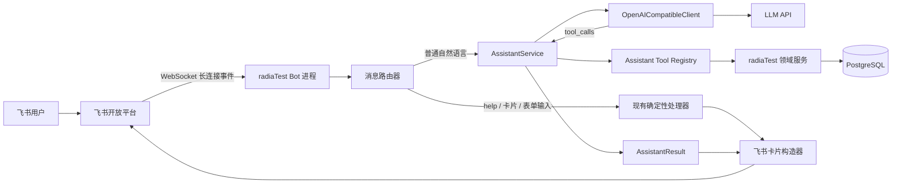
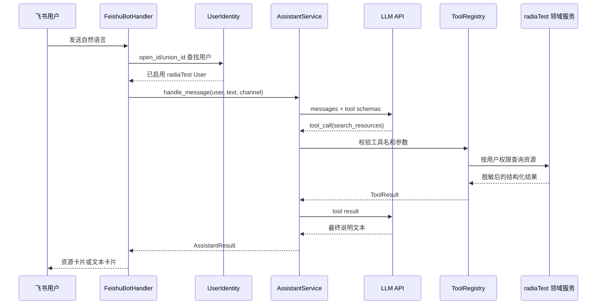

<!--
  Copyright (c) 2026 Huawei Technologies Co., Ltd. All rights reserved.
  This project is licensed under the Mulan PSL v2.
  You can use it according to the terms and conditions of the Mulan PSL v2.
  http://license.coscl.org.cn/MulanPSL2
-->

# Plan: 飞书 LLM 助手集成

## 状态

draft（待评审，尚未开始实现）

## 1. 背景

radiaTest 已经通过独立 `bot` 进程和飞书长连接提供物理机查询、VM 查询与创建、凭据查看和远程命令等卡片能力。当前文本消息只识别 `help`/`帮助`；其他文本主要用于远程命令表单的补充输入，尚不能理解自然语言需求。

已有测试资源平台实现了一个 OpenAI 兼容的 LLM 助手原型，具备：

- OpenAI Chat Completions 兼容客户端；
- Function Calling 工具调用；
- Pydantic 工具参数校验；
- 最多三轮的 LLM、工具、LLM 编排；
- 飞书中未命中确定性命令时转交 LLM；
- 将机器搜索结果渲染为飞书卡片。

本阶段将上述“助手内核”迁移到 radiaTest，但继续使用 radiaTest 自己的飞书应用配置、长连接、身份绑定、权限模型、卡片和领域服务。

## 2. 目标

首版完成以下用户流程：

1. 已绑定 radiaTest 账号的用户在飞书私聊 Bot 中发送自然语言。
2. Bot 保留现有 `help`、卡片交互和远程命令输入行为。
3. 普通自然语言交给 LLM 助手处理。
4. LLM 只能通过已注册工具读取 radiaTest 数据，不能生成并执行任意 SQL。
5. 首版至少支持自然语言查询资源和查看本人资源。
6. 查询得到资源时优先返回可操作的资源卡片；普通说明性问题返回文本卡片。
7. 用户未绑定、被禁用或没有权限时，不调用工具并返回明确提示。
8. LLM 不可用、超时或输出不合法时，Bot 返回可理解的降级提示，现有确定性卡片功能不受影响。

示例：

> 用户：我要一台 aarch64、至少 8 核 16 GB 内存的空闲物理机。

LLM 产生结构化工具调用：

```json
{
  "name": "search_resources",
  "arguments": {
    "resource_type": "physical",
    "arch": "aarch64",
    "min_cpu_cores": 8,
    "min_memory_gb": 16,
    "occupancy": "free",
    "limit": 5
  }
}
```

radiaTest 查询并返回资源数据，最终由飞书层渲染资源列表卡片。LLM 不接触数据库连接、SSH 凭据和明文密码。

## 3. 非目标

本阶段不实现：

- LLM 自动触发测试流水线；
- LLM 自动申请 VM、分配或释放资源；
- LLM 执行远程命令；
- 测试日志分析；
- 多轮持久化会话记忆；
- RAG、向量数据库或知识库问答；
- 让 LLM 生成并执行 SQL；
- 替换现有确定性飞书卡片和命令；
- 复制旧平台的飞书扫码创建应用、Worker 管理器和用户绑定模型。

写操作将在后续阶段通过“LLM 生成操作草案 -> 飞书确认卡片 -> 用户点击确认 -> radiaTest 领域服务执行”的方式实现。

## 4. 设计原则

### 4.1 LLM 负责理解，不负责授权

LLM 只负责把自然语言映射为工具名和结构化参数。用户权限由工具实现和 radiaTest 领域服务判断，不能依赖 Prompt 中的角色描述。

### 4.2 飞书是适配层，不承载业务逻辑

飞书模块负责接收事件、解析用户身份和展示结果。资源查询、用户资源查询和将来的流水线查询放在助手工具或原有领域服务中。

### 4.3 确定性功能优先

`help`、`帮助`、卡片事件和远程命令表单输入继续走原有逻辑。只有不属于确定性流程的普通文本才进入 LLM。

### 4.4 首版只读

首版工具不得修改资源、租约、VM、流水线、用户和凭据。这样可以先验证模型配置、意图理解、权限和卡片展示，不引入误操作风险。

### 4.5 LLM 输出不可信

所有工具参数必须通过 Pydantic 校验；工具名必须来自白名单；工具结果必须经过服务端裁剪；输出到飞书前必须限制长度。

## 5. 总体架构



关键边界：

- `app.modules.feishu`：渠道接入、身份解析、事件响应和卡片展示；
- `app.modules.assistant`：LLM 调用、工具循环、工具注册和统一结果；
- `resources`、`leases`、`vms`：真实业务数据与权限规则；
- LLM API：只看到必要的上下文和脱敏后的工具结果。

## 6. 消息路由

### 6.1 路由优先级

文本消息按以下顺序处理：

1. 非私聊或非文本消息：沿用现有规则忽略；
2. `help` 或 `帮助`：返回现有首页卡片；
3. 当前用户存在待输入的远程命令表单：沿用 `remote_command_text_card()`；
4. 用户未绑定或绑定用户已禁用：返回绑定提示；
5. LLM 功能未启用：返回“智能助手暂未配置”，并保留帮助入口；
6. 其他文本：调用 `AssistantService.handle_message()`。

必须先判断远程命令待输入状态，否则用户在远程命令卡片中输入的 `uname -a` 会被误送给 LLM。

### 6.2 调用时序



## 7. 后端模块设计

新增目录：

```text
backend/app/modules/assistant/
├── __init__.py
├── config.py
├── errors.py
├── llm_client.py
├── models.py
├── prompts.py
├── schemas.py
├── service.py
├── tool_registry.py
└── tools/
    ├── __init__.py
    └── resources.py
```

### 7.1 `llm_client.py`

定义与供应商无关的协议：

```python
class LLMClient(Protocol):
    def complete(
        self,
        messages: list[dict[str, object]],
        tools: list[dict[str, object]],
    ) -> dict[str, object]: ...
```

首个实现为 `OpenAICompatibleClient`，负责：

- 向 `{LLM_BASE_URL}/chat/completions` 发送请求；
- 携带 `Authorization: Bearer <key>`；
- 设置模型、超时、温度和工具定义；
- 将 HTTP、网络、JSON 和响应结构错误转换为统一异常；
- 不记录 API Key、完整请求正文或完整工具结果。

`LLM_BASE_URL` 的约定必须固定：配置值应为 API 的版本根路径，例如：

```text
https://example.com/v1
```

客户端只追加一次 `/chat/completions`，避免历史上出现的 `/chat/completions/chat/completions` 问题。

### 7.2 `service.py`

`AssistantService` 是飞书和 LLM 之间的主入口：

```python
@dataclass(frozen=True)
class AssistantContext:
    user: User
    channel: str
    conversation_id: str | None

@dataclass(frozen=True)
class AssistantResult:
    text: str
    presentation: str
    tool_results: tuple[ToolResult, ...]

def handle_message(
    db: Session,
    context: AssistantContext,
    text: str,
    client: LLMClient,
) -> AssistantResult: ...
```

执行循环：

1. 创建 system、用户身份摘要和 user message；
2. 请求 LLM；
3. 如果返回工具调用，逐个校验并执行；
4. 把工具结果作为 `tool` message 交回 LLM；
5. 最多执行三轮，超过后返回受控错误；
6. 输出 `AssistantResult`，不直接创建飞书卡片。

限制：

- 单次最多 3 轮 LLM 请求；
- 每轮最多 3 个工具调用；
- 用户消息建议最多 2000 字符；
- 工具结果建议最多 20 条资源；
- 最终文本建议最多 3000 字符；
- 单次总超时建议 30 秒。

### 7.3 `tool_registry.py`

每个工具由定义和执行函数组成：

```python
@dataclass(frozen=True)
class AssistantTool:
    name: str
    description: str
    arguments_model: type[BaseModel]
    execute: Callable[[Session, AssistantContext, BaseModel], dict]
```

注册表负责：

- 生成传给 LLM 的 JSON Schema；
- 拒绝未知工具；
- 使用 Pydantic 校验参数；
- 捕获可预期的领域异常；
- 将结果序列化为 JSON；
- 对工具调用记录指标，但不记录敏感返回值。

不使用 `if name == ...` 持续扩大的分支，后续增加流水线工具时只需注册新工具。

### 7.4 `tools/resources.py`

首版实现两个工具。

#### `search_resources`

输入建议：

```python
class SearchResourcesArguments(BaseModel):
    resource_type: Literal["physical", "vm"] | None = None
    arch: str | None = None
    min_cpu_cores: int | None = Field(None, ge=1, le=4096)
    min_memory_gb: int | None = Field(None, ge=1)
    min_nic_count: int | None = Field(None, ge=1, le=64)
    min_nic_speed_gbps: int | None = Field(None, ge=1, le=800)
    disk_type: Literal["hdd", "ssd", "nvme"] | None = None
    min_disk_count: int | None = Field(None, ge=1, le=128)
    min_disk_capacity_gb: int | None = Field(None, ge=1)
    tags: list[str] = Field(default_factory=list, max_length=10)
    occupancy: Literal["free", "occupied"] | None = None
    limit: int = Field(5, ge=1, le=20)
```

实现必须复用 `resources.service` 的查询和序列化能力。返回字段只包含：

- `id`、名称、资源类型；
- 架构、CPU、内存、网卡和磁盘摘要；
- OS IP/BMC IP 是否返回由现有资源可见性规则决定；
- 管理状态、占用状态；
- 当前占用人只在原有权限允许时返回；
- 不返回 SSH/BMC 用户名、密码、密钥和其他凭据。

#### `list_my_resources`

返回当前绑定用户正在占用或创建中的物理机、VM。该工具必须忽略 LLM 传入的任意 `user_id`，用户身份只能来自 `AssistantContext.user`。

### 7.5 `prompts.py`

系统提示词建议保持短而明确：

```text
你是 radiaTest 测试资源平台助手。
只使用提供的工具获取平台事实，不得编造资源、状态、权限、凭据或操作结果。
当前版本只支持查询，不得声称已经创建、分配、释放资源或执行命令。
不要生成 SQL、Shell 命令或访问凭据。
用用户使用的语言简洁回答。
当工具没有结果时明确说明没有匹配资源，并建议用户放宽哪一项条件。
```

用户角色可以作为背景信息提供，但权限仍由工具强制执行。

## 8. 飞书模块改造

### 8.1 `bot_runtime.py`

调整 `FeishuBotHandler.handle_message()`：

- 保留私聊和文本校验；
- 保留 `help` 首页卡片；
- 先尝试现有远程命令待输入处理；
- 查询绑定用户；
- 普通文本调用助手服务；
- 根据 `AssistantResult` 选择卡片；
- 捕获 `AssistantNotConfiguredError`、`LLMTimeoutError`、`AssistantToolError` 等异常并返回降级卡片。

建议把路由判断抽成独立函数，便于单元测试：

```python
def route_private_text(db: Session, message: FeishuIncomingMessage) -> BotReply: ...
```

### 8.2 `assistant_cards.py`

在飞书模块新增专门卡片文件：

```text
backend/app/modules/feishu/assistant_cards.py
```

包含：

- `build_assistant_text_card(text)`；
- `build_assistant_resource_card(resources, summary)`；
- `build_assistant_error_card(message)`；
- `build_assistant_not_configured_card()`。

资源结果卡片应复用现有 `resource_detail` action。LLM 只返回资源 ID 和解释，按钮值由服务端卡片构造器生成，不能使用 LLM 生成的 action JSON。

### 8.3 首页入口

首页增加“智能助手”按钮，点击后返回使用场景卡片，例如：

- “找一台空闲的 aarch64 物理机”；
- “查看我正在使用的资源”；
- “找至少 16 核、32 GB 内存的机器”。

示例只用于帮助用户表达需求，不触发操作。

## 9. 配置与部署

在 `Settings` 增加：

```text
LLM_ASSISTANT_ENABLED=false
LLM_BASE_URL=
LLM_API_KEY=
LLM_MODEL=
LLM_TIMEOUT_SECONDS=30
LLM_MAX_TOOL_ROUNDS=6
```

配置规则：

- `LLM_ASSISTANT_ENABLED=false` 时不要求其他 LLM 配置；
- 启用后，`BASE_URL`、`API_KEY` 和 `MODEL` 必填；
- `API_KEY` 只通过环境变量或 Secret 注入，不进入数据库和 Git；
- `BASE_URL` 去除末尾 `/` 后再拼接一次 `/chat/completions`；
- `bot` 容器需要注入以上变量；
- 如果未来 Web 也使用助手，`backend` 容器再注入同样配置；
- Worker 暂不需要 LLM 配置。

部署健康检查不应依赖外部 LLM 在线，否则 LLM 故障会使 radiaTest 整体被判定不可用。可以单独提供管理员可见的“助手配置检查”。

## 10. 数据模型

首版不保存完整会话，不要求新增会话表。但建议新增最小审计表 `assistant_invocations`：

```text
id                    UUID
user_id               FK users.id
channel               feishu
conversation_id       飞书 chat_id 的哈希或空值
request_id            飞书 message_id
input_length          用户输入长度
tool_names            JSON，仅工具名
status                succeeded/failed/rejected
model_name            模型名称
prompt_version        Prompt 版本
latency_ms             总耗时
error_code            可空
created_at            时间
```

默认不保存：

- 用户完整自然语言；
- 完整 Prompt；
- 完整工具结果；
- LLM 完整响应；
- 资源凭据。

如调试阶段确实需要保存对话，应增加显式开关、脱敏和保留期限，而不是默认记录。

## 11. 错误与降级

| 场景 | 用户提示 | 系统行为 |
|---|---|---|
| 用户未绑定 | 请先在 radiaTest Web 绑定飞书 | 不调用 LLM |
| 用户已禁用 | 当前账号不可用 | 不调用 LLM |
| 助手未配置 | 智能助手暂未启用，可使用首页卡片 | 保留原功能 |
| LLM 超时 | 助手响应超时，请稍后重试 | 记录超时指标 |
| LLM HTTP 错误 | 助手暂时不可用 | 不暴露 API 响应正文 |
| 未知工具 | 无法完成该请求 | 拒绝执行 |
| 参数校验失败 | 无法理解部分条件，请换种表达 | 不查询数据库 |
| 工具无结果 | 没有符合条件的资源 | 给出放宽条件建议 |
| 飞书发送失败 | Bot 日志记录发送错误 | 不重复执行工具 |

异常日志不得包含 API Key、app secret、资源密码或完整工具结果。

## 12. 幂等、并发与性能

首版均为只读查询，不会发生重复写入，但仍应处理飞书重复投递：

- 以飞书 `message_id` 作为请求 ID；
- 在短期缓存或 `assistant_invocations` 上增加唯一约束；
- 已成功处理的重复消息直接忽略；
- 处理中重复消息不再次调用 LLM；
- 单用户同时最多处理一个助手请求，后续消息可返回“上一条请求仍在处理中”；
- 全局增加并发限制，防止多人同时调用拖垮 Bot；
- LLM 调用不能永久阻塞飞书 WebSocket 事件线程。

首版可先同步实现并设置严格超时；如果实际模型经常超过飞书事件处理时限，应改为：

```text
收到消息 -> 立即回复“正在处理” -> Celery 执行助手任务 -> 主动发送结果卡片
```

异步化属于部署验证后的性能调整，不应改变 `AssistantService` 接口。

## 13. 安全要求

1. 不允许 `execute_sql`、`execute_shell`、`read_credentials` 等通用工具。
2. 工具只能调用明确的领域服务或受控 SQLAlchemy 查询。
3. 每个工具都从 `AssistantContext.user` 获取真实用户，禁止模型指定用户身份。
4. 查询工具沿用 Web 端相同的数据可见性规则。
5. 工具结果在发给 LLM 前删除密码、密钥、token、app secret 等字段。
6. LLM 输出只能作为文本或资源 ID 使用，不能直接作为飞书卡片 action。
7. 卡片按钮由服务端生成并再次鉴权。
8. Prompt injection 不能扩展工具集合或绕过工具参数校验。
9. API Key 通过环境变量注入并在日志过滤器中脱敏。
10. 外部 LLM 是否允许接收内网 IP、主机名和用户名必须经过部署环境的数据合规确认；必要时仅发送资源编号和硬件规格。

## 14. 测试方案

### 14.1 LLM 客户端单元测试

- URL 只拼接一次 `/chat/completions`；
- 正确发送模型、messages 和 tools；
- 处理 200、400、401、429、500 和超时；
- 处理无 `choices`、无 `message`、非法 JSON；
- 错误文本不泄露 API Key。

### 14.2 AssistantService 单元测试

- LLM 直接回答；
- 一轮工具调用后回答；
- 多轮工具调用；
- 超过最大轮数；
- 未知工具；
- 工具参数非法；
- 空回答；
- 工具领域异常；
- 结果长度裁剪。

测试使用 Fake LLM Client，不访问真实模型 API。

### 14.3 工具测试

- 按架构、CPU、内存、网卡、磁盘和占用状态过滤；
- 组合条件；
- 没有结果；
- `limit` 上限；
- 普通用户与管理员可见数据差异；
- 返回值不包含任何凭据字段；
- `list_my_resources` 只能查看当前上下文用户。

### 14.4 飞书路由测试

- `help` 不进入 LLM；
- 远程命令待输入不进入 LLM；
- 未绑定用户不进入 LLM；
- 已禁用用户不进入 LLM；
- 普通文本进入助手；
- 资源工具结果生成资源卡片；
- 资源卡片“详情”按钮沿用现有 action；
- LLM 异常生成降级卡片；
- 群聊和非文本消息保持原行为。

### 14.5 集成测试

使用 Mock HTTP Server 模拟 OpenAI 兼容接口：

1. 飞书消息事件进入 `FeishuBotHandler`；
2. 身份绑定解析成功；
3. Mock LLM 返回 `search_resources`；
4. 工具查询测试数据库；
5. Mock LLM 返回总结；
6. 捕获发送器收到正确资源卡片。

### 14.6 服务器验收

至少验证：

1. `help` 和已有资源卡片行为未回归；
2. “查看我的资源”返回当前用户资源；
3. “找一台空闲的 aarch64 物理机”返回匹配卡片；
4. 复杂硬件条件能够转换为结构化参数；
5. 无匹配资源时提示合理；
6. 未绑定用户无法查询；
7. 停止或错误配置 LLM 服务时，现有 Bot 功能仍可用；
8. 日志中没有 API Key 和资源密码；
9. 连续重复发送同一飞书事件不会重复调用模型；
10. 资源卡片详情按钮可继续进入现有详情页。

## 15. 文件变更清单

预计新增：

```text
backend/app/modules/assistant/__init__.py
backend/app/modules/assistant/errors.py
backend/app/modules/assistant/llm_client.py
backend/app/modules/assistant/models.py
backend/app/modules/assistant/prompts.py
backend/app/modules/assistant/schemas.py
backend/app/modules/assistant/service.py
backend/app/modules/assistant/tool_registry.py
backend/app/modules/assistant/tools/__init__.py
backend/app/modules/assistant/tools/resources.py
backend/app/modules/feishu/assistant_cards.py
backend/tests/test_assistant_llm_client.py
backend/tests/test_assistant_service.py
backend/tests/test_assistant_tools.py
backend/tests/test_feishu_assistant.py
```

预计修改：

```text
backend/app/core/config.py
backend/app/modules/feishu/bot_runtime.py
backend/app/modules/feishu/cards.py
deploy/docker-compose.server.yml
.env.example
README.md
```

如果采用 `assistant_invocations`，还需增加模型、Alembic migration 和对应测试。

## 16. 实施任务

- [ ] T1：补充 ADR，确认数据边界、首版只读和确定性路由优先级。
- [ ] T2：增加 LLM 配置和 OpenAI 兼容客户端，完成单元测试。
- [ ] T3：实现 AssistantService、工具注册表和 Fake Client 测试。
- [ ] T4：实现 `search_resources`、`list_my_resources` 及权限/脱敏测试。
- [ ] T5：改造飞书文本路由，确保 help 和远程命令输入不回归。
- [ ] T6：实现助手文本卡片、资源卡片和首页入口。
- [ ] T7：增加请求去重、超时、并发限制和最小调用审计。
- [ ] T8：完成集成测试、服务器真实模型测试和飞书验收。
- [ ] T9：更新 README、部署配置和故障排查文档。

## 17. 验收标准

满足以下条件才视为本阶段完成：

- 不修改现有飞书应用配置和用户绑定方式；
- 不影响 `help`、资源卡片、VM 创建和远程命令；
- 已绑定用户可以使用自然语言查询资源；
- 所有平台事实均来自工具，LLM 无法直接访问数据库；
- 首版没有任何 LLM 发起的写操作；
- 权限判断在服务端完成；
- 工具参数全部经过 Pydantic 校验；
- LLM 不可用时现有 Bot 仍正常；
- 不向 LLM 或日志发送资源凭据；
- 自动化测试覆盖客户端、编排、工具、飞书路由和异常降级；
- 服务器真实 API 与飞书端到端测试通过。

## 18. 后续扩展

本阶段稳定后，再按以下顺序扩展：

1. 流水线配置、执行状态和失败用例只读查询工具；
2. 流水线触发草案与飞书确认卡片；
3. 测试日志预处理和 LLM 原因分析；
4. 根据更新内容推荐 Mugen 用例；
5. 生成候选测试用例并提交人工审核；
6. 形成“需求理解 -> 测试规划 -> 人工确认 -> 流水线执行 -> 日志分析”的辅助测试 Agent。
